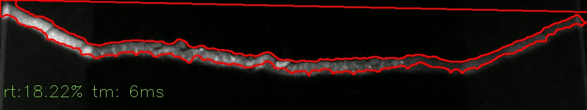
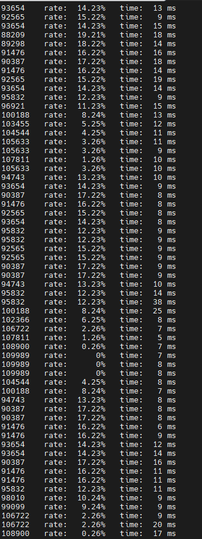

# 煤矿-传送带出煤量视觉估算算法实现
功能介绍：
煤矿企业传送带传输量视觉算法实现：
该部分代码为核心的计算每一帧图片煤在传送槽中横截面积和槽横截面面积的比例，在知道传送带横截面积情况下就可以计算出传送带的运输量。
计算绘图如下：

后台打印如下：

## 环境安装:
python3.10

apt-get update
apt-get install libgl1
apt-get install ffmpeg libsm6 libxext6  -y

# opencv4.8
pip install opencv-python
pip install opencv-contrib-python

## 加速版本：
如果在硬件上部署有更高的速度需求，可以考虑使用c++或者opencv的cuda版本加速等重写，实现思路一致。

该代码仅供学习参考，不可用于商用目的。